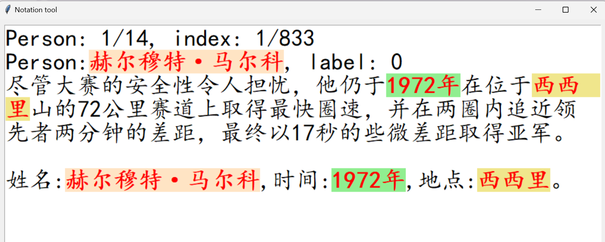

# GUI-Based Data Labeling Tool

This is a Python-based GUI application that allows users to efficiently label data by highlighting key information such as person, time, and location within a given sentence. The tool provides a user-friendly interface to streamline the labeling process and ensure accurate data annotation.

## Features

1. **Sentence Display**: The application displays the current sentence along with associated metadata, including the person, label, and time and location information.
2. **Highlighting**: The tool automatically highlights the person, time, and location elements within the sentence, making it easy to visually identify the relevant information.
3. **Labeling**: Users can label the sentence as "true", "false", or "dirty data" using keyboard shortcuts (0, 1, and 5, respectively). The labeled information is stored in the data structure for future reference.
4. **Navigation**: Users can navigate through the dataset by moving to the previous or next sentence using the corresponding keyboard shortcuts.
5. **Data Persistence**: The tool saves the labeled data to a file, ensuring that the work is not lost and can be resumed at a later time.

## Usage

1. Ensure you have the following dependencies installed:
   - Python
   - Tkinter
   - Pandas
2. Download or clone the repository to your local machine.
3. Open the `GUI_notation.py` file in your preferred Python IDE or editor.
4. Modify the `origin_data` variable to point to your dataset file.
5. Run the script to launch the GUI-based data labeling tool.
6. Use the keyboard shortcuts to label the sentences as you navigate through the dataset.
7. The labeled data will be saved automatically to the corresponding file.

## Contributing

If you find any issues or have suggestions for improvements, feel free to create a new issue or submit a pull request. Contributions are always welcome!

## License

This project is licensed under the MIT License.